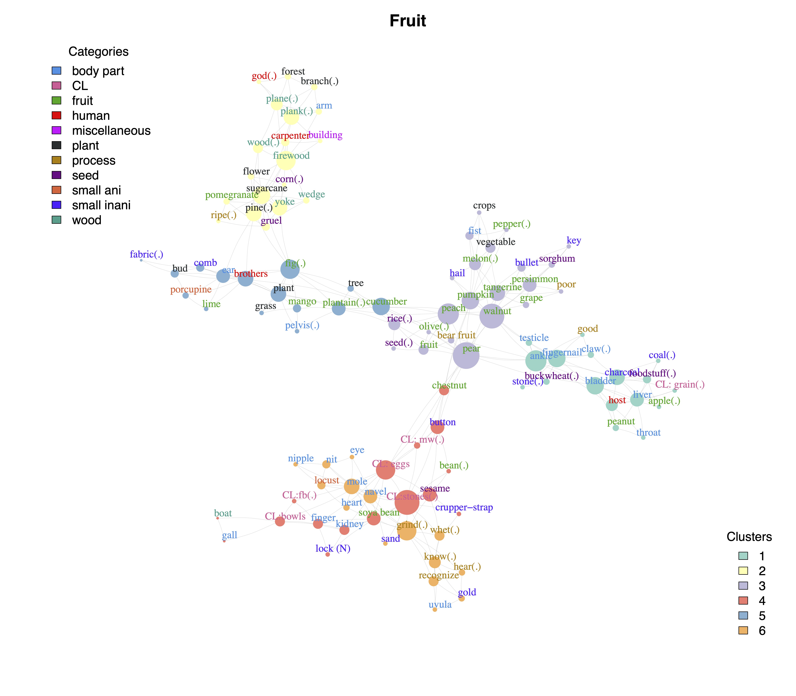
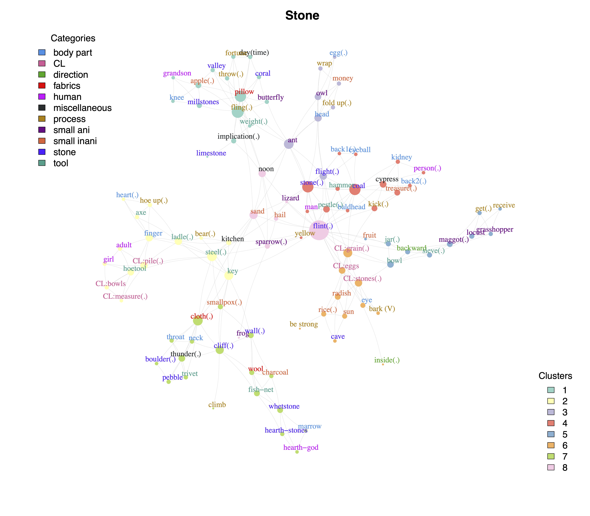

# A network analysis of the semantic evolution of ‘fruit’ and ‘stone’ in Tibeto-Burman languages

The lexemes ‘fruit’ and ‘stone’ are known as the origins of the numeral classifiers for small round objects in many Tibeto-Burman languages. This paper employs a correlation-based network construction method to investigate the colexification networks of the two concepts in 60 + 68 Tibeto-Burman languages. A total of 104 concepts colexified with ‘fruit’ and 99 concepts colexified with ‘stone’ are organized into macro semantic classes. Semantic networks on the basis of the similarities in colexification patterns of concepts, as well as languages networks on the basis of the similarities in colexification patterns of languages, are constructed for ‘fruit’ and ‘stone’, respectively. The results show that compound nouns are in the central positions in the colexification networks of both concepts. Classifiers for small round objects evolved from either ‘fruit’ or ‘stone’ are directly colexified with class terms in compound nouns denoting varieties of fruits/stones and the shape class of small round objects, indicating that they are diachronically related. Moreover, languages that have developed classifiers from ‘fruit’ are mostly from the Ngwi subgroup, whereas languages whose classifiers are colexified with ‘stone’ evolved independently. 

## Fruit Network

## Stone Network

